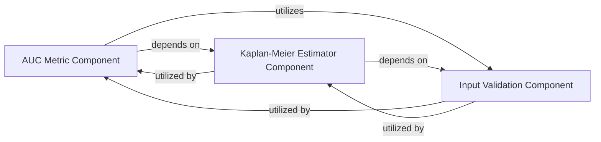

## Details

Analysis of the `AUC Metric` subsystem in `torchsurv` package, focusing on its core components and their interdependencies for calculating and validating time-dependent AUC values in survival analysis.

### AUC Metric Component
This component is the core of the `AUC Metric` subsystem. It is responsible for calculating time-dependent AUC values, their integral, confidence intervals (using Blanche's and bootstrap methods), and performing one-sample hypothesis tests for p-values. It also supports statistical comparison between two AUCs. Its primary function is to quantify the discriminatory power of survival models.

**Related Classes/Methods**:

- <a href=".src/torchsurv/metrics/auc.py#L12-L1283" target="_blank" rel="noopener noreferrer">`torchsurv.metrics.auc.Auc` (12:1283)</a>
- <a href=".src/torchsurv/metrics/auc.py#L303-L364" target="_blank" rel="noopener noreferrer">`torchsurv.metrics.auc.Auc:integral` (303:364)</a>
- <a href=".src/torchsurv/metrics/auc.py#L1-L1" target="_blank" rel="noopener noreferrer">`torchsurv.metrics.auc._auc_se` (1:1)</a>
- <a href=".src/torchsurv/metrics/auc.py#L60-L301" target="_blank" rel="noopener noreferrer">`torchsurv.metrics.auc.Auc:__call__` (60:301)</a>

### Kaplan-Meier Estimator Component
This component estimates survival probabilities or censoring distributions using the Kaplan-Meier method. It calculates events, censored observations, and individuals at risk at unique time points. Within the `AUC Metric` subsystem, it provides essential survival function estimates required for AUC integral and standard error calculations.

**Related Classes/Methods**:

- <a href=".src/torchsurv/stats/kaplan_meier.py#L9-L252" target="_blank" rel="noopener noreferrer">`torchsurv.stats.kaplan_meier.KaplanMeierEstimator` (9:252)</a>
- <a href=".src/torchsurv/stats/kaplan_meier.py#L12-L92" target="_blank" rel="noopener noreferrer">`torchsurv.stats.kaplan_meier.KaplanMeierEstimator:__call__` (12:92)</a>

### Input Validation Component
This utility component validates the format, type, and content of input data, including survival data (event and time), evaluation time points, and model estimates. Its role is to ensure data integrity and prevent errors in downstream calculations within other components.

**Related Classes/Methods**:

- <a href=".src/torchsurv/tools/validate_inputs.py#L3-L37" target="_blank" rel="noopener noreferrer">`torchsurv.tools.validate_inputs.validate_survival_data` (3:37)</a>
- <a href=".src/torchsurv/tools/validate_inputs.py#L40-L83" target="_blank" rel="noopener noreferrer">`torchsurv.tools.validate_inputs.validate_evaluation_time` (40:83)</a>
- <a href=".src/torchsurv/tools/validate_inputs.py#L86-L120" target="_blank" rel="noopener noreferrer">`torchsurv.tools.validate_inputs.validate_estimate` (86:120)</a>

### [FAQ](https://github.com/CodeBoarding/GeneratedOnBoardings/tree/main?tab=readme-ov-file#faq)