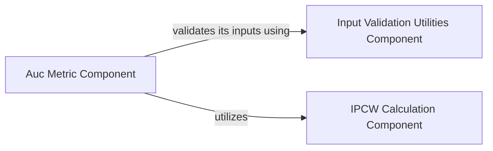

## Details

One paragraph explaining the functionality which is represented by this graph. What the main flow is and what is its purpose.

### Auc Metric Component [[Expand]](./Auc_Metric_Component.md)
This component is dedicated to computing the time-dependent Area Under the Receiver Operating Characteristic Curve (AUC). It supports both cumulative/dynamic and incident/dynamic AUC calculations, making it versatile for various survival analysis contexts. A key feature is its ability to incorporate Inverse Probability of Censoring Weights (IPCW), which is essential for obtaining unbiased estimations when dealing with censored data, a common challenge in survival analysis.

**Related Classes/Methods**:

- <a href=".src/torchsurv/metrics/auc.py#L12-L1283" target="_blank" rel="noopener noreferrer">`torchsurv.metrics.auc.Auc` (12:1283)</a>

### Input Validation Utilities Component
This component is fundamental as it ensures the robustness and reliability of the entire system. Without proper input validation, the Auc Metric Component could receive malformed data, leading to incorrect results or system crashes. It acts as a crucial safeguard.

**Related Classes/Methods**:

- <a href=".src/torchsurv/tools/validate_inputs.py#L0-L0" target="_blank" rel="noopener noreferrer">`torchsurv.tools.validate_inputs` (0:0)</a>

### IPCW Calculation Component [[Expand]](./IPCW_Calculation_Component.md)
This component is fundamental because it addresses a significant challenge in survival analysis: censored data. By providing IPCW, it enables the Auc Metric Component to produce statistically sound and unbiased results, which is critical for accurate model evaluation in real-world scenarios.

**Related Classes/Methods**:

- <a href=".src/torchsurv/stats/ipcw.py#L11-L76" target="_blank" rel="noopener noreferrer">`torchsurv.stats.ipcw.get_ipcw` (11:76)</a>

### [FAQ](https://github.com/CodeBoarding/GeneratedOnBoardings/tree/main?tab=readme-ov-file#faq)