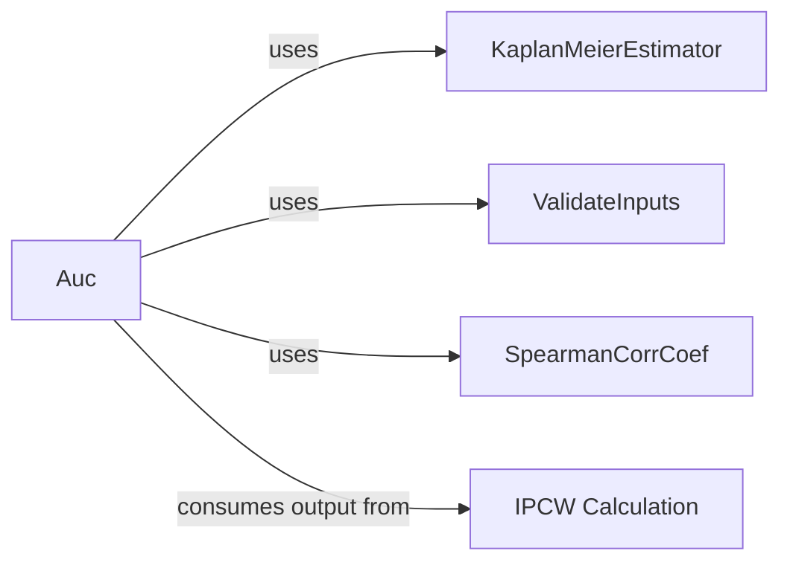

## Details

This overview details the structure, flow, and purpose of the `Auc Metric Component`, focusing on the `torchsurv.metrics.auc.Auc` class and its key interactions within the `torchsurv` project.

### Auc [[Expand]](./Auc.md)
The core component responsible for computing the time-dependent Area Under the Receiver Operating Characteristic Curve (AUC). It supports both cumulative/dynamic and incident/dynamic AUC calculations, and provides methods for integral calculation, confidence intervals, p-values, and comparison of AUCs.

**Related Classes/Methods**:

- <a href=".src/torchsurv/metrics/auc.py#L12-L1283" target="_blank" rel="noopener noreferrer">`torchsurv.metrics.auc.Auc` (12:1283)</a>

### KaplanMeierEstimator [[Expand]](./KaplanMeierEstimator.md)
A statistical estimator component that calculates the Kaplan-Meier survival curve. This is used by the Auc component to estimate survival probabilities, which are crucial for integrating AUC over time and for Inverse Probability of Censoring Weight (IPCW) calculations.

**Related Classes/Methods**:

- <a href=".src/torchsurv/stats/kaplan_meier.py#L9-L252" target="_blank" rel="noopener noreferrer">`torchsurv.stats.kaplan_meier.KaplanMeierEstimator` (9:252)</a>

### ValidateInputs
A utility component responsible for ensuring the correctness and consistency of input data (e.g., `estimate`, `event`, `time`, `new_time`) used by the Auc component. It performs various checks to prevent errors and ensure valid calculations.

**Related Classes/Methods**:

- `torchsurv.utils.validate_inputs.ValidateInputs` (0:0)

### SpearmanCorrCoef
A statistical component that computes the Spearman's rank correlation coefficient between two sets of data. It is specifically used by the Auc component when performing statistical comparisons between two AUC curves using the Blanche method.

**Related Classes/Methods**:

- `torchsurv.stats.regression.SpearmanCorrCoef` (0:0)

### IPCW Calculation
This conceptual component (represented by functions like `get_ipcw` within the `ipcw` module) is responsible for calculating Inverse Probability of Censoring Weights (IPCW). These weights are essential for adjusting AUC estimates in the presence of censored data, providing unbiased results in survival analysis. The Auc component consumes these weights.

**Related Classes/Methods**:

- <a href=".src/torchsurv/stats/ipcw.py#L11-L76" target="_blank" rel="noopener noreferrer">`torchsurv.stats.ipcw.get_ipcw` (11:76)</a>

### [FAQ](https://github.com/CodeBoarding/GeneratedOnBoardings/tree/main?tab=readme-ov-file#faq)