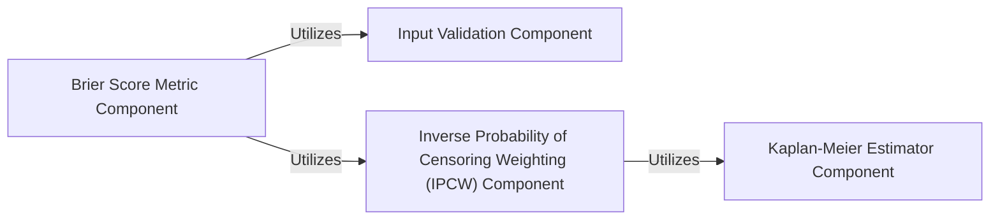

## Details

This analysis focuses on the `Brier Score Metric` component within the `torchsurv` project, detailing its structure, functionality, and interactions with other key components. The Brier Score is a critical metric for evaluating the accuracy of survival predictions, especially in the presence of censored data.

### Brier Score Metric Component
This is the core component responsible for calculating the time-dependent Brier Score, a measure of prediction accuracy for survival models. It handles various aspects, including the computation of the score itself, its integrated form, and statistical inference such as confidence intervals, p-values, and comparisons between different models. It is designed to incorporate inverse probability of censoring weights (IPCW) to account for censored observations, ensuring robust and unbiased evaluations.

**Related Classes/Methods**:

- <a href=".src/torchsurv/metrics/brier_score.py#L10-L903" target="_blank" rel="noopener noreferrer">`torchsurv.metrics.brier_score.BrierScore` (10:903)</a>

### Input Validation Component
This component provides essential utility functions to rigorously validate the format, type, and content of input data used in survival analysis calculations. Specifically, it ensures the correctness of survival data (event indicators and times), evaluation time points, and survival probability estimates. By performing these checks, it prevents common data-related errors and enhances the reliability and stability of downstream computations within the Brier Score Metric and other related components.

**Related Classes/Methods**:

- <a href=".src/torchsurv/tools/validate_inputs.py#L3-L37" target="_blank" rel="noopener noreferrer">`torchsurv.tools.validate_inputs.validate_survival_data` (3:37)</a>
- <a href=".src/torchsurv/tools/validate_inputs.py#L40-L83" target="_blank" rel="noopener noreferrer">`torchsurv.tools.validate_inputs.validate_evaluation_time` (40:83)</a>
- <a href=".src/torchsurv/tools/validate_inputs.py#L86-L120" target="_blank" rel="noopener noreferrer">`torchsurv.tools.validate_inputs.validate_estimate` (86:120)</a>

### Inverse Probability of Censoring Weighting (IPCW) Component
This component is crucial for handling censored data in survival analysis. It calculates inverse probability of censoring weights, which are used to adjust the contributions of observations to various metrics (like the Brier Score) based on their censoring status. This adjustment helps to mitigate bias introduced by censoring, providing more accurate and representative evaluations of survival model performance. The calculation of these weights typically relies on estimating the censoring distribution, often via a Kaplan-Meier estimator.

**Related Classes/Methods**:

- <a href=".src/torchsurv/stats/ipcw.py#L11-L76" target="_blank" rel="noopener noreferrer">`torchsurv.stats.ipcw.get_ipcw` (11:76)</a>

### Kaplan-Meier Estimator Component
This component provides the functionality to estimate survival probabilities using the non-parametric Kaplan-Meier method. It is fundamental for constructing baseline survival curves and, more importantly in this context, for estimating the censoring distribution. The output of this component is often used as an input for the Inverse Probability of Censoring Weighting (IPCW) component, making it an indirect but vital dependency for accurate Brier Score calculations in the presence of censoring.

**Related Classes/Methods**:

- <a href=".src/torchsurv/stats/kaplan_meier.py#L9-L252" target="_blank" rel="noopener noreferrer">`torchsurv.stats.kaplan_meier.KaplanMeierEstimator` (9:252)</a>

### [FAQ](https://github.com/CodeBoarding/GeneratedOnBoardings/tree/main?tab=readme-ov-file#faq)