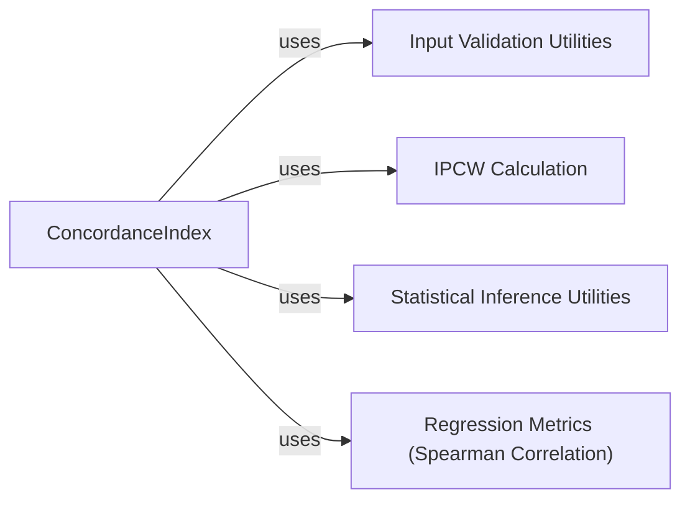

## Details

Detailed component analysis of the `torchsurv.metrics.cindex` module, focusing on the `ConcordanceIndex` class and its interactions with related utilities and their justifications for selection. The analysis identifies five key components: `ConcordanceIndex`, `Input Validation Utilities`, `IPCW Calculation`, `Statistical Inference Utilities`, and `Regression Metrics (Spearman Correlation)`, outlining their descriptions, source code references, and inter-component relationships. These components represent distinct, cohesive units fundamental to accurate, robust, and statistically sound Concordance Index computation, from data preparation and weighting to statistical inference and comparison.

### ConcordanceIndex [[Expand]](./ConcordanceIndex.md)
This is the primary class responsible for computing the Concordance Index (C-index). It encapsulates the core logic for handling tied risk scores, incorporating Inverse Probability of Censoring Weighting (IPCW), and providing methods for statistical analysis such as confidence interval calculation (Noether, Bootstrap, Conservative) and p-value computation. It manages the internal state required for C-index computation and offers functionalities for comparing C-index values.

**Related Classes/Methods**:

- <a href=".src/torchsurv/metrics/cindex.py#L12-L910" target="_blank" rel="noopener noreferrer">`torchsurv.metrics.cindex.ConcordanceIndex` (12:910)</a>

### Input Validation Utilities
This component provides utility functions to validate the format, type, and correctness of input data, specifically survival data (time and event status) and model estimates. It ensures that the data conforms to expected structures before being processed by the `ConcordanceIndex` class, preventing errors and ensuring reliable computations.

**Related Classes/Methods**:

- `torchsurv.utils.validation.validate_survival_data` (1:1)
- `torchsurv.utils.validation.validate_estimate` (1:1)

### IPCW Calculation
This component is responsible for calculating Inverse Probability of Censoring Weights (IPCW). These weights are crucial for adjusting the Concordance Index calculation in the presence of censored data, as they are used to weight observations in the C-index computation.

**Related Classes/Methods**:

- `torchsurv.utils.ipcw.get_ipcw` (1:1)

### Statistical Inference Utilities
This component provides statistical functions necessary for calculating confidence intervals and p-values related to the Concordance Index. These include functions for normal and t-distribution calculations, which are fundamental for statistical inference.

**Related Classes/Methods**:

- `torchsurv.utils.stat_utils.normal_icdf` (1:1)
- `torchsurv.utils.stat_utils.t_cdf` (1:1)

### Regression Metrics (Spearman Correlation)
This component provides the functionality to compute Spearman's rank correlation coefficient. This metric is utilized when comparing two Concordance Index values, assessing the monotonic relationship between the risk predictions.

**Related Classes/Methods**:

- `torchsurv.metrics.spearman.SpearmanCorrCoef` (1:1)

### [FAQ](https://github.com/CodeBoarding/GeneratedOnBoardings/tree/main?tab=readme-ov-file#faq)