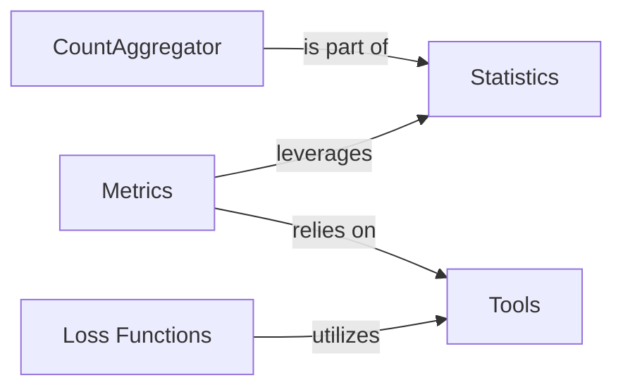

## Details

Component overview for the `torchsurv` library, including `CountAggregator` and other identified abstract components, along with their relationships and a justification for their fundamental nature.

### CountAggregator [[Expand]](./CountAggregator.md)
This internal component, conceptually represented by the `_compute_counts` method within the `KaplanMeierEstimator` class, is responsible for processing raw survival data to derive the essential counts required for the Kaplan-Meier formula. This includes identifying unique time points, calculating the number of events at each time, determining the number of individuals at risk, and counting censored observations. Its fundamental role is to transform raw survival data into the aggregated statistics necessary for the survival probability calculations.

**Related Classes/Methods**:

- <a href=".src/torchsurv/stats/kaplan_meier.py#L197-L252" target="_blank" rel="noopener noreferrer">`torchsurv.stats.kaplan_meier.KaplanMeierEstimator:_compute_counts` (197:252)</a>

### Loss Functions [[Expand]](./Loss_Functions.md)
This component provides various loss functions essential for training survival models. These functions quantify the discrepancy between predicted and actual survival outcomes, guiding the model's learning process.

**Related Classes/Methods**:

- <a href=".src/torchsurv/loss/cox.py#L0-L0" target="_blank" rel="noopener noreferrer">`torchsurv.loss.cox` (0:0)</a>
- <a href=".src/torchsurv/loss/momentum.py#L0-L0" target="_blank" rel="noopener noreferrer">`torchsurv.loss.momentum` (0:0)</a>
- <a href=".src/torchsurv/loss/weibull.py#L0-L0" target="_blank" rel="noopener noreferrer">`torchsurv.loss.weibull` (0:0)</a>

### Metrics [[Expand]](./Metrics.md)
This component offers a suite of evaluation metrics specifically tailored for survival analysis. These metrics are used to assess the performance and accuracy of survival models, providing quantitative measures of their effectiveness.

**Related Classes/Methods**:

- <a href=".src/torchsurv/metrics/auc.py#L0-L0" target="_blank" rel="noopener noreferrer">`torchsurv.metrics.auc` (0:0)</a>
- <a href=".src/torchsurv/metrics/brier_score.py#L0-L0" target="_blank" rel="noopener noreferrer">`torchsurv.metrics.brier_score` (0:0)</a>
- <a href=".src/torchsurv/metrics/cindex.py#L0-L0" target="_blank" rel="noopener noreferrer">`torchsurv.metrics.cindex` (0:0)</a>

### Statistics [[Expand]](./Statistics.md)
This component provides core statistical utilities relevant to survival analysis. It includes methods for non-parametric estimation, such as the Kaplan-Meier estimator, and techniques for handling censored data, like Inverse Probability of Censoring Weighting (IPCW). The `KaplanMeierEstimator` class within this component is responsible for processing raw survival data to derive essential counts (number of events, individuals at risk, and censored observations) at unique time points, which are fundamental for calculating survival probabilities. The internal `_compute_counts` method (part of the `CountAggregator` conceptual component) is central to this aggregation process.

**Related Classes/Methods**:

- <a href=".src/torchsurv/stats/ipcw.py#L0-L0" target="_blank" rel="noopener noreferrer">`torchsurv.stats.ipcw` (0:0)</a>
- <a href=".src/torchsurv/stats/kaplan_meier.py#L0-L0" target="_blank" rel="noopener noreferrer">`torchsurv.stats.kaplan_meier` (0:0)</a>
- <a href=".src/torchsurv/stats/kaplan_meier.py#L9-L252" target="_blank" rel="noopener noreferrer">`torchsurv.stats.kaplan_meier.KaplanMeierEstimator` (9:252)</a>

### Tools
This component contains general utility functions that support other parts of the `torchsurv` library. Its primary role is to provide input validation routines, ensuring that data passed to other components meets the expected format and constraints, thereby enhancing the robustness and reliability of the library.

**Related Classes/Methods**:

- <a href=".src/torchsurv/tools/validate_inputs.py#L0-L0" target="_blank" rel="noopener noreferrer">`torchsurv.tools.validate_inputs` (0:0)</a>

### [FAQ](https://github.com/CodeBoarding/GeneratedOnBoardings/tree/main?tab=readme-ov-file#faq)