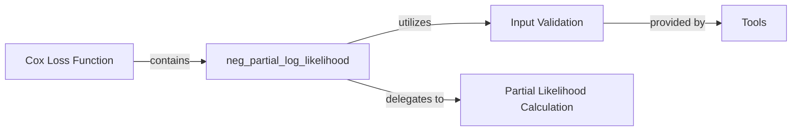

## Details

Component Overview: `Cox Loss Function`
The `Cox Loss Function` component is a fundamental part of the `torchsurv` library, specifically designed for training Cox proportional hazards models. Its core purpose is to compute the negative log-partial likelihood, which serves as the objective function for these models. This loss function is crucial for survival analysis as it effectively handles censored data and focuses on the relative ordering of event times, without requiring assumptions about the baseline hazard function. The internal helper functions and the reliance on the `Tools` component for input validation further highlight its well-structured and robust design, ensuring accurate and reliable loss computation.

### Cox Loss Function [[Expand]](./Cox_Loss_Function.md)
The `Cox Loss Function` component is a fundamental part of the `torchsurv` library, specifically designed for training Cox proportional hazards models. Its core purpose is to compute the negative log-partial likelihood, which serves as the objective function for these models. This loss function is crucial for survival analysis as it effectively handles censored data and focuses on the relative ordering of event times, without requiring assumptions about the baseline hazard function.

**Related Classes/Methods**:

- <a href=".src/torchsurv/loss/cox.py#L9-L167" target="_blank" rel="noopener noreferrer">`torchsurv.loss.cox.neg_partial_log_likelihood` (9:167)</a>
- <a href=".src/torchsurv/tools/validate_inputs.py#L1-L1" target="_blank" rel="noopener noreferrer">`torchsurv.tools.validate_inputs._check_inputs` (1:1)</a>
- <a href=".src/torchsurv/loss/cox.py#L170-L198" target="_blank" rel="noopener noreferrer">`torchsurv.loss.cox._partial_likelihood_cox` (170:198)</a>
- <a href=".src/torchsurv/loss/cox.py#L201-L246" target="_blank" rel="noopener noreferrer">`torchsurv.loss.cox._partial_likelihood_efron` (201:246)</a>
- <a href=".src/torchsurv/loss/cox.py#L249-L276" target="_blank" rel="noopener noreferrer">`torchsurv.loss.cox._partial_likelihood_breslow` (249:276)</a>

### neg_partial_log_likelihood
This is the central function within the `Cox Loss Function` component. Its primary responsibility is to calculate the negative partial log-likelihood, orchestrating the entire loss calculation process, including sorting data, checking for ties, and applying the appropriate partial likelihood method.

**Related Classes/Methods**:

- <a href=".src/torchsurv/loss/cox.py#L9-L167" target="_blank" rel="noopener noreferrer">`torchsurv.loss.cox.neg_partial_log_likelihood` (9:167)</a>
- <a href=".src/torchsurv/tools/validate_inputs.py#L1-L1" target="_blank" rel="noopener noreferrer">`torchsurv.tools.validate_inputs._check_inputs` (1:1)</a>
- <a href=".src/torchsurv/loss/cox.py#L170-L198" target="_blank" rel="noopener noreferrer">`torchsurv.loss.cox._partial_likelihood_cox` (170:198)</a>
- <a href=".src/torchsurv/loss/cox.py#L201-L246" target="_blank" rel="noopener noreferrer">`torchsurv.loss.cox._partial_likelihood_efron` (201:246)</a>
- <a href=".src/torchsurv/loss/cox.py#L249-L276" target="_blank" rel="noopener noreferrer">`torchsurv.loss.cox._partial_likelihood_breslow` (249:276)</a>

### Input Validation
Ensures the validity and correct format of the input tensors using `_check_inputs`.

**Related Classes/Methods**:

- <a href=".src/torchsurv/tools/validate_inputs.py#L1-L1" target="_blank" rel="noopener noreferrer">`torchsurv.tools.validate_inputs._check_inputs` (1:1)</a>

### Partial Likelihood Calculation
Delegates the actual partial likelihood calculation to specialized internal functions (`_partial_likelihood_cox`, `_partial_likelihood_efron`, `_partial_likelihood_breslow`) based on whether ties are present and which tie-handling method is chosen.

**Related Classes/Methods**:

- <a href=".src/torchsurv/loss/cox.py#L170-L198" target="_blank" rel="noopener noreferrer">`torchsurv.loss.cox._partial_likelihood_cox` (170:198)</a>
- <a href=".src/torchsurv/loss/cox.py#L201-L246" target="_blank" rel="noopener noreferrer">`torchsurv.loss.cox._partial_likelihood_efron` (201:246)</a>
- <a href=".src/torchsurv/loss/cox.py#L249-L276" target="_blank" rel="noopener noreferrer">`torchsurv.loss.cox._partial_likelihood_breslow` (249:276)</a>

### Tools
A utility component providing functions like input validation.

**Related Classes/Methods**:

- <a href=".src/torchsurv/tools/validate_inputs.py#L1-L1" target="_blank" rel="noopener noreferrer">`torchsurv.tools.validate_inputs` (1:1)</a>

### [FAQ](https://github.com/CodeBoarding/GeneratedOnBoardings/tree/main?tab=readme-ov-file#faq)