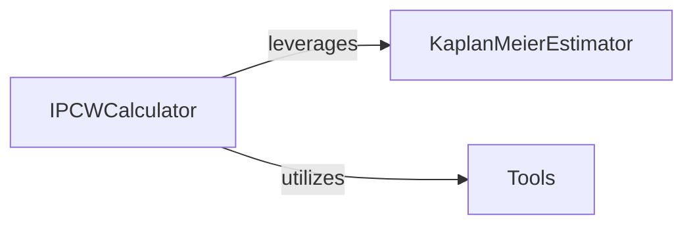

## Details

Overview of the IPCWCalculator component and its fundamental interactions within the torchsurv project.

### IPCWCalculator [[Expand]](./IPCWCalculator.md)
Responsible for calculating Inverse Probability of Censoring Weights (IPCW) by leveraging other components.

**Related Classes/Methods**:

- <a href=".src/torchsurv/stats/ipcw.py#L11-L76" target="_blank" rel="noopener noreferrer">`torchsurv.stats.ipcw.get_ipcw` (11:76)</a>

### KaplanMeierEstimator [[Expand]](./KaplanMeierEstimator.md)
Provides Kaplan-Meier estimation, used by IPCWCalculator to estimate censoring distribution.

**Related Classes/Methods**:

- <a href=".src/torchsurv/stats/kaplan_meier.py#L9-L252" target="_blank" rel="noopener noreferrer">`torchsurv.stats.kaplan_meier.KaplanMeierEstimator` (9:252)</a>

### Tools
Provides utility functions, specifically for input validation of survival data.

**Related Classes/Methods**:

- <a href=".src/torchsurv/tools/validate_inputs.py#L3-L37" target="_blank" rel="noopener noreferrer">`torchsurv.tools.validate_inputs.validate_survival_data` (3:37)</a>

### [FAQ](https://github.com/CodeBoarding/GeneratedOnBoardings/tree/main?tab=readme-ov-file#faq)