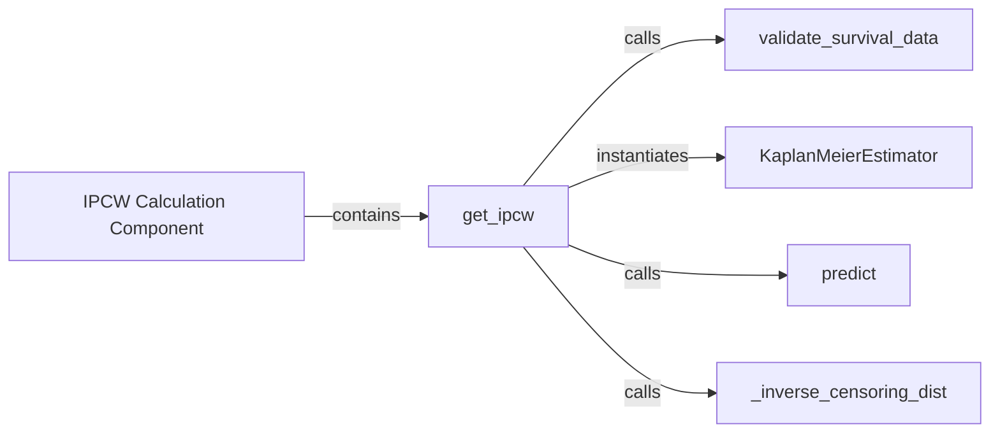

## Details

This is the overarching logical component responsible for handling censored data in survival analysis by computing Inverse Probability Censoring Weights (IPCW). Its primary purpose is to enable unbiased evaluation of survival models, especially for metrics like AUC, by accounting for individuals who drop out of the study before an event occurs.

### IPCW Calculation Component [[Expand]](./IPCW_Calculation_Component.md)
This is the overarching logical component responsible for handling censored data in survival analysis by computing Inverse Probability Censoring Weights (IPCW). Its primary purpose is to enable unbiased evaluation of survival models, especially for metrics like AUC, by accounting for individuals who drop out of the study before an event occurs.

**Related Classes/Methods**: _None_

### get_ipcw
The central function within the IPCW Calculation Component. It orchestrates the entire IPCW calculation process, from input validation to the final weight computation. It acts as the main entry point for users to obtain IPCW values.

**Related Classes/Methods**:

- `get_ipcw` (0:0)

### validate_survival_data
A utility function that performs crucial input validation for survival data (event and time tensors). It ensures data integrity and correctness before any complex calculations, preventing runtime errors and ensuring the reliability of the IPCW computation.

**Related Classes/Methods**:

- `validate_survival_data` (0:0)

### KaplanMeierEstimator [[Expand]](./KaplanMeierEstimator.md)
A class implementation of the Kaplan-Meier estimator, specifically utilized here to model the censoring distribution. By fitting this estimator to censoring times, it provides the probabilities of an individual remaining uncensored over time, which are essential for calculating inverse probabilities.

**Related Classes/Methods**:

- `KaplanMeierEstimator` (0:0)

### predict
This method, part of the KaplanMeierEstimator class, is responsible for generating survival probabilities (or censoring probabilities when configured) at specific time points. In the context of IPCW, it provides the estimated probability of being uncensored up to a given time.

**Related Classes/Methods**:

- `KaplanMeierEstimator:predict` (0:0)

### _inverse_censoring_dist
An internal helper function that performs the final mathematical inversion of the censoring probabilities to yield the Inverse Probability Censoring Weights. This is the direct calculation of the weights themselves.

**Related Classes/Methods**:

- `_inverse_censoring_dist` (0:0)

### [FAQ](https://github.com/CodeBoarding/GeneratedOnBoardings/tree/main?tab=readme-ov-file#faq)