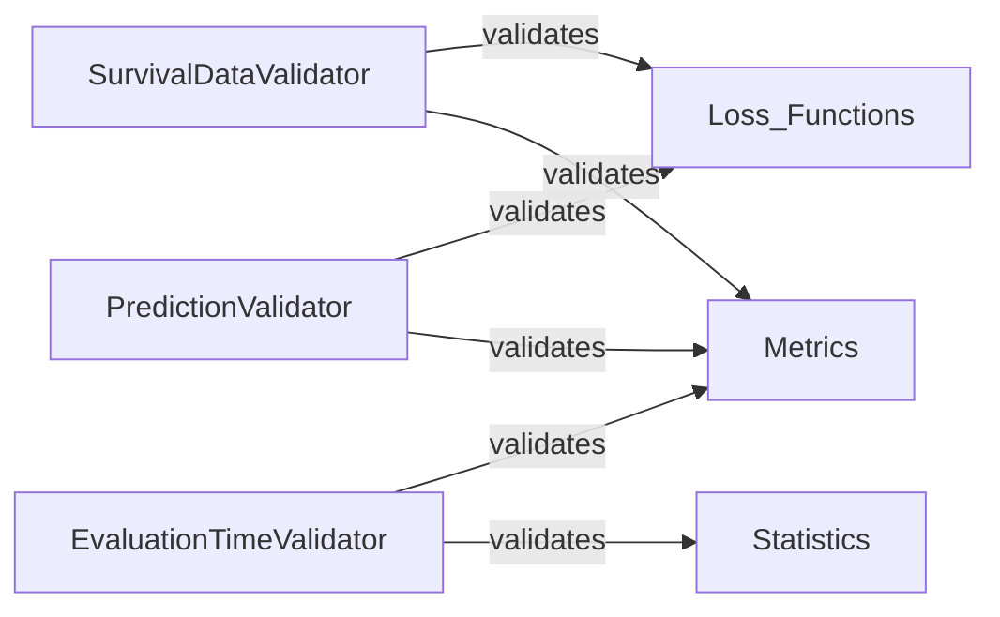

## Details

This component is a utility responsible for rigorously validating various input data types, including survival event indicators, event/censoring times, evaluation time points, and model predictions. Its primary purpose is to ensure data integrity and adherence to expected formats and constraints (e.g., data types, dimensions, value ranges), thereby preventing errors and ensuring the robust and reliable operation of survival metric calculations and model training processes within the torchsurv library.

### SurvivalDataValidator
This component is responsible for validating the core survival data, specifically the event times and event indicators. It ensures that these inputs are correctly formatted (e.g., as PyTorch tensors), have appropriate data types (e.g., float for times, boolean/integer for indicators), and adhere to logical constraints (e.g., event times are non-negative).

**Related Classes/Methods**:

- <a href=".src/torchsurv/tools/validate_inputs.py#L3-L37" target="_blank" rel="noopener noreferrer">`torchsurv.tools.validate_inputs.validate_survival_data` (3:37)</a>

### EvaluationTimeValidator
This component focuses on validating the time points at which survival metrics or predictions are to be evaluated. It checks for correct data types, tensor format, and logical consistency of these time points.

**Related Classes/Methods**:

- <a href=".src/torchsurv/tools/validate_inputs.py#L40-L83" target="_blank" rel="noopener noreferrer">`torchsurv.tools.validate_inputs.validate_evaluation_time` (40:83)</a>

### PredictionValidator
This component is dedicated to validating the model's output predictions, such as survival probabilities or hazard functions. It verifies the format, data type, and dimensions of these predictions to ensure they are suitable for subsequent calculations (e.g., loss computation, metric evaluation).

**Related Classes/Methods**:

- <a href=".src/torchsurv/tools/validate_inputs.py#L86-L120" target="_blank" rel="noopener noreferrer">`torchsurv.tools.validate_inputs.validate_estimate` (86:120)</a>

### [FAQ](https://github.com/CodeBoarding/GeneratedOnBoardings/tree/main?tab=readme-ov-file#faq)