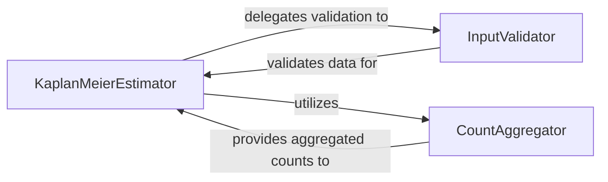

## Details

This subsystem is designed to perform Kaplan-Meier survival analysis, providing a robust and user-friendly interface for estimating survival probabilities from time-to-event data. It focuses on data validation, efficient aggregation of counts, and the core Kaplan-Meier computation, along with visualization and prediction capabilities.

### KaplanMeierEstimator [[Expand]](./KaplanMeierEstimator.md)
This is the central and primary component of the subsystem. It orchestrates the entire Kaplan-Meier estimation process, from initial data handling and validation (delegated to `InputValidator`) to the internal computation of aggregated counts (`CountAggregator`) and the final calculation of survival probabilities. It also provides user-facing functionalities such as plotting the survival curve, predicting survival probabilities at new time points, and printing the survival table. Its core responsibility is to encapsulate the Kaplan-Meier algorithm and expose it through a clear interface.

**Related Classes/Methods**:

- `KaplanMeierEstimator` (1:1)

### InputValidator [[Expand]](./InputValidator.md)
This component focuses solely on ensuring the validity and correct format of the input survival data (event times and event indicators). It acts as a safeguard against malformed or incorrect data, preventing errors in subsequent computations within the `KaplanMeierEstimator`. It performs checks for tensor types, data types (boolean for event, float for time), dimension consistency, presence of events, and non-negative times.

**Related Classes/Methods**:

- `InputValidator` (1:1)

### CountAggregator [[Expand]](./CountAggregator.md)
This internal logical component, implemented as the `_compute_counts` method within the `KaplanMeierEstimator` class, is responsible for aggregating the input survival data to derive the counts of individuals at risk, the number of events, and the number of censored observations at each unique time point. These aggregated counts are fundamental and directly used in the Kaplan-Meier formula for calculating survival probabilities.

**Related Classes/Methods**:

- `KaplanMeierEstimator:_compute_counts` (1:1)

### [FAQ](https://github.com/CodeBoarding/GeneratedOnBoardings/tree/main?tab=readme-ov-file#faq)