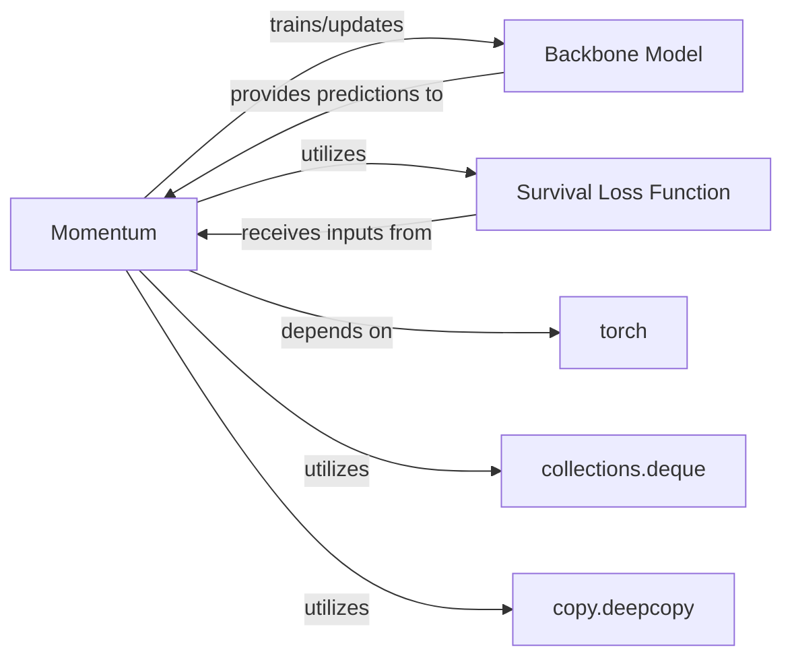

## Details

This section provides a detailed overview of the Momentum Training Strategy component, which is primarily implemented by the Momentum class within the torchsurv.loss.momentum module. This strategy is fundamental for enhancing the stability and accelerating the convergence of survival models by decoupling the effective batch size from the actual batch size.

### Momentum
This component implements a sophisticated momentum-based training strategy for survival models. It manages two neural networks: an "online" network (actively trained) and a "target" network (updated via Exponential Moving Average (EMA) of the online network's parameters). It maintains memory banks of past predictions from both networks, which are then combined with current batch predictions to compute a pooled loss. This strategy aims to improve training stability and accelerate convergence by effectively increasing the batch size without requiring more memory.

**Related Classes/Methods**:

- <a href=".src/torchsurv/loss/momentum.py#L9-L212" target="_blank" rel="noopener noreferrer">`torchsurv.loss.momentum.Momentum` (9:212)</a>

### Backbone Model
Represents the actual survival prediction model (both the "online" and "target" networks) whose parameters are being optimized by the Momentum Training Strategy. This model takes input features and outputs predictions relevant to survival analysis (e.g., risk scores, survival probabilities).

**Related Classes/Methods**: _None_

### Survival Loss Function
A standard loss function specifically designed for survival analysis tasks. The Momentum Training Strategy utilizes this function to compute the base loss between predicted and true survival outcomes, which is then potentially modified or pooled with momentum-related terms.

**Related Classes/Methods**: _None_

### torch [[Expand]](./torch.md)
The foundational deep learning framework that provides tensor operations, neural network modules, automatic differentiation, and optimization algorithms. The Momentum Training Strategy heavily relies on PyTorch for all its computational needs.

**Related Classes/Methods**: _None_

### collections.deque
A Python double-ended queue data structure used by the Momentum Training Strategy to efficiently maintain and manage memory banks of past predictions from both the online and target networks. This allows for the "decoupling" of effective batch size.

**Related Classes/Methods**: _None_

### copy.deepcopy
A Python utility for creating a deep copy of objects. In the context of the Momentum Training Strategy, it is used to initialize the "target" network by creating a complete, independent copy of the "online" network, ensuring that parameter updates to one do not directly affect the other, except through the EMA mechanism.

**Related Classes/Methods**: _None_

### [FAQ](https://github.com/CodeBoarding/GeneratedOnBoardings/tree/main?tab=readme-ov-file#faq)