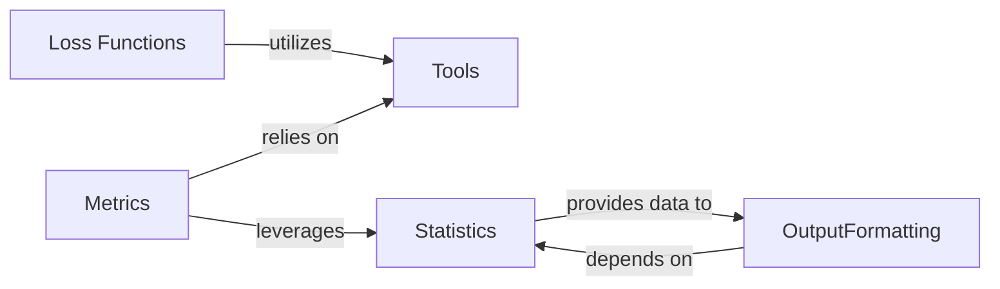

## Details

Here's a refined overview of the `torchsurv` subsystem, detailing its core components, their responsibilities, and their interactions.

### Loss Functions [[Expand]](./Loss_Functions.md)
This component provides various loss functions essential for training survival models. These functions quantify the discrepancy between predicted and actual survival outcomes, guiding the model's learning process. They are fundamental because they drive the optimization process of any survival model, enabling the model to learn from data by minimizing prediction errors.

**Related Classes/Methods**: _None_

### Metrics [[Expand]](./Metrics.md)
This component offers a suite of evaluation metrics specifically tailored for survival analysis. These metrics are used to assess the performance and accuracy of survival models. They are fundamental for evaluating the effectiveness of trained models, providing quantitative measures of how well a model predicts survival outcomes and allowing for comparison between different models.

**Related Classes/Methods**: _None_

### Statistics [[Expand]](./Statistics.md)
This component provides core statistical utilities relevant to survival analysis, such as methods for Kaplan-Meier estimation and Inverse Probability of Censoring Weighting (IPCW). These are fundamental for data preparation, analysis, and often used in conjunction with model evaluation. They are crucial for foundational statistical analyses and for preparing data in a way that is suitable for survival modeling.

**Related Classes/Methods**: _None_

### Tools
This component contains general utility functions that support other parts of the `torchsurv` library. Specifically, it includes input validation routines to ensure that data passed to other components meets the expected format and constraints, enhancing robustness. This component is fundamental for ensuring data integrity and the reliable operation of other components by validating inputs before processing, thereby preventing errors and improving system stability.

**Related Classes/Methods**: _None_

### OutputFormatting [[Expand]](./OutputFormatting.md)
This component is responsible for presenting the Kaplan-Meier estimation results in a structured, human-readable tabular format. By displaying unique time points alongside their corresponding survival estimates, it provides a clear, concise, and easily digestible summary of the analysis, which is fundamental for reporting and further analysis. Its current implementation is tightly coupled with the `KaplanMeierEstimator`. This component is fundamental because it transforms raw analytical results into an understandable format, making the insights accessible for users and subsequent reporting, bridging the gap between complex calculations and practical application.

**Related Classes/Methods**: _None_

### [FAQ](https://github.com/CodeBoarding/GeneratedOnBoardings/tree/main?tab=readme-ov-file#faq)