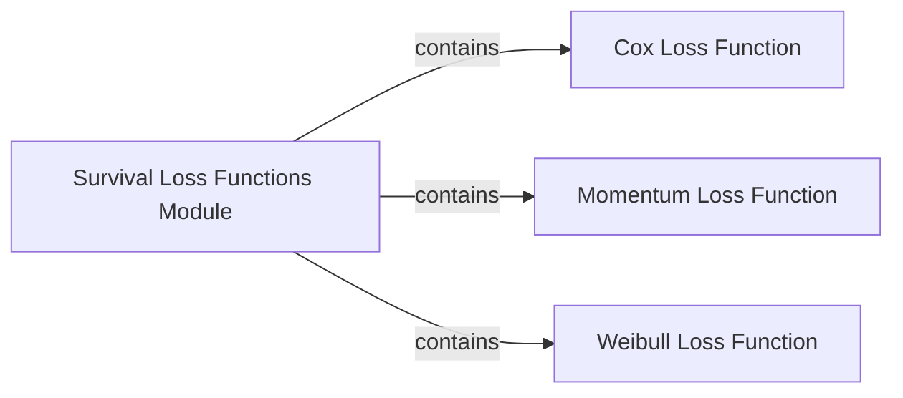

## Details

These components were chosen because they directly correspond to the distinct loss functions identified in the initial problem description and confirmed by the file structure. They are fundamental because they represent the core mathematical objectives that enable survival models to learn from data. Without these specific loss functions, the models would lack the necessary mechanisms to quantify prediction errors and optimize their parameters for survival outcomes. Each loss function addresses different modeling assumptions and provides unique benefits for various survival analysis scenarios. The `Survival Loss Functions Module` acts as the logical container, making these individual loss functions accessible and organized. The `getClassHierarchy` tool did not reveal any internal class inheritance within the `torchsurv.loss` package, suggesting that these loss functions are likely implemented as standalone functions or classes that inherit from external libraries (e.g., PyTorch's `nn.Module`) rather than from a common base class defined within this specific package.

### Survival Loss Functions Module [[Expand]](./Survival_Loss_Functions_Module.md)
This module serves as a collection point for various loss functions tailored for survival analysis. It provides a unified interface for accessing specialized loss functions like Cox, Momentum, and Weibull, which are crucial for training survival models by quantifying prediction errors against censored and uncensored survival data.

**Related Classes/Methods**:

- `torchsurv.loss` (1:1)

### Cox Loss Function [[Expand]](./Cox_Loss_Function.md)
Implements the negative log-partial likelihood loss, which is the cornerstone objective function for Cox proportional hazards models. This loss function is particularly effective for survival data as it focuses on the relative ordering of event times and inherently handles censored observations without requiring assumptions about the baseline hazard function.

**Related Classes/Methods**:

- <a href=".src/torchsurv/loss/cox.py#L1-L1" target="_blank" rel="noopener noreferrer">`torchsurv.loss.cox` (1:1)</a>

### Momentum Loss Function [[Expand]](./Momentum_Loss_Function.md)
Provides a specialized loss function that likely incorporates a momentum-like term to potentially enhance the stability and convergence speed of training for survival models. The exact mathematical formulation and its benefits would be detailed within its source code, aiming to improve optimization dynamics.

**Related Classes/Methods**:

- <a href=".src/torchsurv/loss/momentum.py#L1-L1" target="_blank" rel="noopener noreferrer">`torchsurv.loss.momentum` (1:1)</a>

### Weibull Loss Function [[Expand]](./Weibull_Loss_Function.md)
Implements a loss function derived from the Weibull distribution, a common parametric model used to describe time-to-event data. This loss typically involves fitting the parameters of a Weibull distribution to the observed survival times, making it suitable for models that assume a specific underlying distribution for survival.

**Related Classes/Methods**:

- <a href=".src/torchsurv/loss/weibull.py#L1-L1" target="_blank" rel="noopener noreferrer">`torchsurv.loss.weibull` (1:1)</a>

### [FAQ](https://github.com/CodeBoarding/GeneratedOnBoardings/tree/main?tab=readme-ov-file#faq)