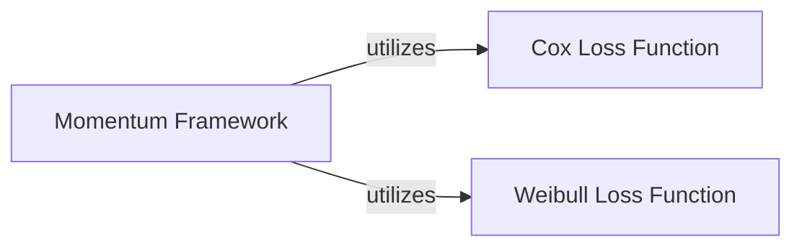

## Details

These three components are fundamental to the `Survival Loss Functions Module` for the following reasons:
1.  **`Momentum Framework` (`Momentum` class)**: This component is crucial because it represents a higher-level training strategy that *consumes* and *orchestrates* the use of individual loss functions. It's not merely a loss function itself, but a sophisticated mechanism for training survival models, particularly in scenarios where decoupling batch size from training size is beneficial. Its role in managing online/target networks and a memory bank makes it a central piece of the training architecture, providing a unified interface for applying various survival loss functions within an advanced training paradigm.
2.  **`Cox Loss Function` (`neg_partial_log_likelihood`)**: This is a cornerstone of survival analysis. The Cox proportional hazards model is one of the most widely used models, and its partial likelihood is the standard way to quantify prediction error for this model. Its inclusion directly addresses the need for a non-parametric, rank-based loss function, making it indispensable for a comprehensive survival analysis library.
3.  **`Weibull Loss Function` (`neg_log_likelihood`)**: The Weibull model is a prominent parametric model in survival analysis, offering a different approach to modeling survival times compared to the Cox model. Providing its negative log-likelihood as a distinct component ensures that the module supports both non-parametric (Cox) and parametric (Weibull) modeling strategies, catering to a broader range of survival analysis tasks.

Together, these components form a robust and versatile `Survival Loss Functions Module`, offering both specific loss calculations and a framework to apply them effectively in complex training scenarios.

### Momentum Framework
This component implements a sophisticated survival framework that leverages momentum update learning to decouple batch size during model training. It operates with two concurrent neural networks (an online network and a target network) and a memory bank of previously computed log hazards. It orchestrates the training process by combining current batch estimates with historical data from the memory bank to compute the loss, and then updates the target network using an exponential moving average (EMA) of the online network's parameters.

**Related Classes/Methods**:

- <a href=".src/torchsurv/loss/momentum.py#L9-L212" target="_blank" rel="noopener noreferrer">`Momentum` (9:212)</a>

### Cox Loss Function [[Expand]](./Cox_Loss_Function.md)
This component provides the implementation for the negative partial log-likelihood loss function, specifically designed for the Cox proportional hazards model. It calculates the loss based on log relative hazards, event indicators, and time-to-event data, with support for handling tied event times using either Efron's or Breslow's method. It is a core mathematical component for training Cox models.

**Related Classes/Methods**:

- <a href=".src/torchsurv/loss/cox.py#L9-L167" target="_blank" rel="noopener noreferrer">`cox.neg_partial_log_likelihood` (9:167)</a>

### Weibull Loss Function [[Expand]](./Weibull_Loss_Function.md)
This component provides the implementation for the negative log-likelihood loss function tailored for the Weibull Accelerated Time Failure (AFT) survival model. It computes the loss using the log scale and log shape parameters of the Weibull distribution, along with event indicators and time-to-event data. It is a fundamental parametric loss function for survival analysis.

**Related Classes/Methods**:

- <a href=".src/torchsurv/loss/weibull.py#L7-L119" target="_blank" rel="noopener noreferrer">`weibull.neg_log_likelihood` (7:119)</a>

### [FAQ](https://github.com/CodeBoarding/GeneratedOnBoardings/tree/main?tab=readme-ov-file#faq)