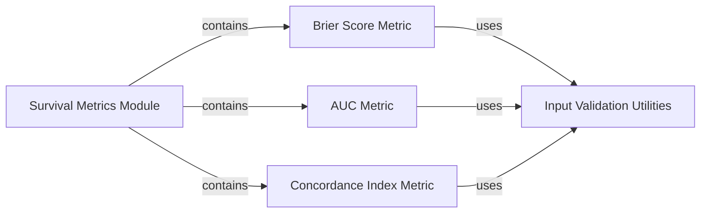

## Details

This subsystem, `Survival Metrics`, is designed to provide a comprehensive suite of tools for evaluating the performance of survival models. It centralizes various standard metrics, ensuring robust and reliable assessment of model predictions.

### Survival Metrics Module
This is the overarching module (`torchsurv.metrics`) that serves as the central hub for various survival model evaluation metrics. It encapsulates implementations for standard metrics such as AUC, Brier Score, and Concordance Index, providing a unified interface for assessing model performance. It acts as the primary entry point for users to access the available metrics.

**Related Classes/Methods**:

- `Survival Metrics Module` (1:1)

### Brier Score Metric [[Expand]](./Brier_Score_Metric.md)
This component is dedicated to the calculation and analysis of the Brier Score, a measure of prediction accuracy for survival models. It provides the core logic for computing the score, handling survival data, event times, and predictions, often including considerations for censoring and time-dependency.

**Related Classes/Methods**:

- `Brier Score Metric` (1:1)

### AUC Metric [[Expand]](./AUC_Metric.md)
This component is responsible for calculating the Area Under the Curve (AUC) for survival models, a common metric for evaluating discriminatory power. It assesses how well the model distinguishes between individuals who experience an event and those who do not, based on their predicted survival probabilities.

**Related Classes/Methods**:

- `AUC Metric` (1:1)

### Concordance Index Metric
This component calculates the Concordance Index (C-index), a measure of the predictive accuracy of survival models. It indicates how well the model's predictions are in agreement with the observed outcomes, specifically concerning the ordering of survival times, considering censored data.

**Related Classes/Methods**:

- `Concordance Index Metric` (1:1)

### Input Validation Utilities
This utility component provides a set of robust functions dedicated to validating the format, type, and constraints of input data used across the `torchsurv` library, particularly for survival analysis metrics. It ensures that survival data (event, time), evaluation times, and model estimates conform to expected standards, thereby preventing runtime errors and ensuring the reliability of subsequent calculations.

**Related Classes/Methods**:

- `Input Validation Utilities` (1:1)

### [FAQ](https://github.com/CodeBoarding/GeneratedOnBoardings/tree/main?tab=readme-ov-file#faq)