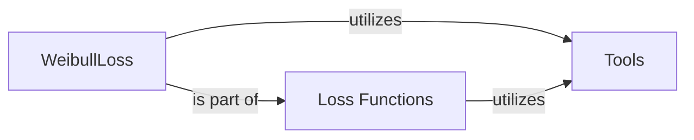

## Details

This analysis describes the core components of the `torchsurv` library, focusing on the `WeibullLoss` function, its role within the `Loss Functions` component, and its reliance on the `Tools` component for data validation. These components collectively provide the foundational elements for building and training survival models, ensuring both mathematical accuracy and data integrity.

### WeibullLoss [[Expand]](./WeibullLoss.md)
This component is specifically designed to compute the negative log-likelihood for survival models that utilize the Weibull distribution. It encapsulates the mathematical functions required for survival analysis under this distribution, including calculations for survival probability, log hazard, and cumulative hazard. A key aspect of this component is its internal validation checks, which ensure that input data conforms to the expected shapes and types, thereby maintaining data integrity and preventing computational errors.

**Related Classes/Methods**:

- <a href=".src/torchsurv/loss/weibull.py#L1-L1" target="_blank" rel="noopener noreferrer">`torchsurv.loss.weibull` (1:1)</a>
- <a href=".src/torchsurv/tools/validate_inputs.py#L1-L1" target="_blank" rel="noopener noreferrer">`torchsurv.tools.validate_inputs` (1:1)</a>

### Loss Functions [[Expand]](./Loss_Functions.md)
This is an abstract component that serves as a collection point for various loss functions used in training survival models within the `torchsurv` library. Its primary purpose is to quantify the discrepancy between a model's predictions and the actual observed survival outcomes. By minimizing these loss values during training, models learn to make more accurate predictions. `WeibullLoss` is one of the concrete implementations within this component.

**Related Classes/Methods**:

- <a href=".src/torchsurv/loss/cox.py#L1-L1" target="_blank" rel="noopener noreferrer">`torchsurv.loss.cox` (1:1)</a>
- <a href=".src/torchsurv/loss/momentum.py#L1-L1" target="_blank" rel="noopener noreferrer">`torchsurv.loss.momentum` (1:1)</a>
- <a href=".src/torchsurv/loss/weibull.py#L1-L1" target="_blank" rel="noopener noreferrer">`torchsurv.loss.weibull` (1:1)</a>
- <a href=".src/torchsurv/tools/validate_inputs.py#L1-L1" target="_blank" rel="noopener noreferrer">`torchsurv.tools.validate_inputs` (1:1)</a>

### Tools
This component acts as a utility hub, providing essential helper functions that support the robust operation of other components within the `torchsurv` library. Its core responsibility is to offer input validation routines, ensuring that data passed between different parts of the system adheres to predefined formats and constraints. This prevents common errors related to incorrect data shapes or types, enhancing the overall stability and reliability of the library.

**Related Classes/Methods**:

- <a href=".src/torchsurv/tools/validate_inputs.py#L1-L1" target="_blank" rel="noopener noreferrer">`torchsurv.tools.validate_inputs` (1:1)</a>

### [FAQ](https://github.com/CodeBoarding/GeneratedOnBoardings/tree/main?tab=readme-ov-file#faq)