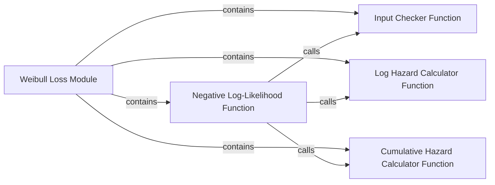

## Details

This subsystem provides the implementation for the negative log-likelihood loss function specifically designed for the Weibull Accelerated Time Failure (AFT) survival model. It computes the loss using the log scale and log shape parameters of the Weibull distribution, along with event indicators and time-to-event data. It serves as a fundamental parametric loss function for survival analysis.

### Weibull Loss Module
This module serves as the conceptual container for all functions related to calculating the negative log-likelihood loss based on the Weibull distribution. It acts as a cohesive unit for Weibull-specific survival analysis computations, encapsulating the core loss function and its essential helper utilities.

**Related Classes/Methods**:

- <a href=".src/torchsurv/loss/weibull.py#L0-L0" target="_blank" rel="noopener noreferrer">`torchsurv.loss.weibull` (0:0)</a>

### Negative Log-Likelihood Function
This is the primary function of the subsystem. It computes the negative log-likelihood for the Weibull distribution, which is the objective function minimized during model training. It orchestrates calls to helper functions to perform its calculation, taking `log_params` (log scale and log shape), `event` indicators, and `time` (time-to-event) as inputs.

**Related Classes/Methods**:

- <a href=".src/torchsurv/loss/weibull.py#L7-L119" target="_blank" rel="noopener noreferrer">`torchsurv.loss.weibull.neg_log_likelihood` (7:119)</a>

### Input Checker Function
A private utility function responsible for validating the input tensors (`log_params`, `event`, `time`) to ensure they meet the necessary shape and type requirements for the Weibull loss calculation. This prevents common runtime errors and ensures data integrity before computations proceed.

**Related Classes/Methods**:

- <a href=".src/torchsurv/loss/weibull.py#L337-L362" target="_blank" rel="noopener noreferrer">`torchsurv.loss.weibull._check_inputs` (337:362)</a>

### Log Hazard Calculator Function
This function calculates the logarithm of the hazard function for the Weibull distribution. The hazard function represents the instantaneous risk of an event at a given time, and its logarithm is a crucial intermediate component in the negative log-likelihood formula.

**Related Classes/Methods**:

- <a href=".src/torchsurv/loss/weibull.py#L188-L259" target="_blank" rel="noopener noreferrer">`torchsurv.loss.weibull.log_hazard` (188:259)</a>

### Cumulative Hazard Calculator Function
This function computes the cumulative hazard function for the Weibull distribution. The cumulative hazard represents the total accumulated risk up to a given time, and it is another essential element required for the accurate calculation of the negative log-likelihood.

**Related Classes/Methods**:

- <a href=".src/torchsurv/loss/weibull.py#L262-L314" target="_blank" rel="noopener noreferrer">`torchsurv.loss.weibull.cumulative_hazard` (262:314)</a>

### [FAQ](https://github.com/CodeBoarding/GeneratedOnBoardings/tree/main?tab=readme-ov-file#faq)