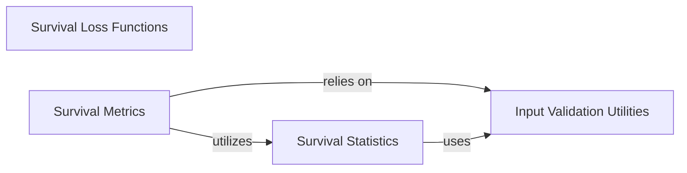

## Details

Final architecture analysis for `torchsurv`, focusing on its core components and their interactions. This analysis identifies the central modules and their responsibilities within the `torchsurv` project, outlining their relationships to provide a high-level data flow overview.

### Survival Loss Functions [[Expand]](./Survival_Loss_Functions.md)
This module provides a collection of loss functions specifically designed for training survival models. It includes implementations for common survival analysis objectives such as Cox proportional hazards, Weibull, and Momentum-based losses, enabling models to learn from censored and uncensored survival data.

**Related Classes/Methods**:

- <a href=".src/torchsurv/loss/cox.py#L1-L1" target="_blank" rel="noopener noreferrer">`torchsurv.loss.cox` (1:1)</a>
- <a href=".src/torchsurv/loss/momentum.py#L1-L1" target="_blank" rel="noopener noreferrer">`torchsurv.loss.momentum` (1:1)</a>
- <a href=".src/torchsurv/loss/weibull.py#L1-L1" target="_blank" rel="noopener noreferrer">`torchsurv.loss.weibull` (1:1)</a>

### Survival Metrics [[Expand]](./Survival_Metrics.md)
This module offers a comprehensive suite of metrics to evaluate the performance and predictive accuracy of survival models. It includes key evaluation criteria such as the Concordance Index (C-index), Area Under the Curve (AUC), and Brier Score, providing robust tools for model assessment.

**Related Classes/Methods**:

- <a href=".src/torchsurv/metrics/auc.py#L1-L1" target="_blank" rel="noopener noreferrer">`torchsurv.metrics.auc` (1:1)</a>
- <a href=".src/torchsurv/metrics/brier_score.py#L1-L1" target="_blank" rel="noopener noreferrer">`torchsurv.metrics.brier_score` (1:1)</a>
- <a href=".src/torchsurv/metrics/cindex.py#L1-L1" target="_blank" rel="noopener noreferrer">`torchsurv.metrics.cindex` (1:1)</a>

### Survival Statistics [[Expand]](./Survival_Statistics.md)
This module provides fundamental statistical tools and estimators crucial for survival analysis. It includes implementations like the Kaplan-Meier Estimator for non-parametric survival curve estimation and Inverse Probability of Censoring Weighting (IPCW) for handling censored data in various statistical contexts.

**Related Classes/Methods**:

- <a href=".src/torchsurv/stats/ipcw.py#L1-L1" target="_blank" rel="noopener noreferrer">`torchsurv.stats.ipcw` (1:1)</a>
- <a href=".src/torchsurv/stats/kaplan_meier.py#L1-L1" target="_blank" rel="noopener noreferrer">`torchsurv.stats.kaplan_meier` (1:1)</a>

### Input Validation Utilities
This module contains a set of utility functions specifically designed to validate the format, consistency, and integrity of input data used across various `torchsurv` components. It ensures that survival data, model estimates, and evaluation times conform to expected structures and types, preventing common data-related errors.

**Related Classes/Methods**:

- <a href=".src/torchsurv/tools/validate_inputs.py#L1-L1" target="_blank" rel="noopener noreferrer">`torchsurv.tools.validate_inputs` (1:1)</a>

### [FAQ](https://github.com/CodeBoarding/GeneratedOnBoardings/tree/main?tab=readme-ov-file#faq)