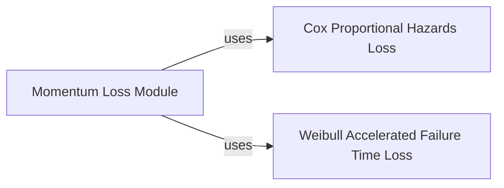

## Details

The torchsurv.loss subsystem is a critical part of the torchsurv project, focusing on providing various loss functions essential for training survival analysis models. It encompasses standard loss functions for common survival models and an advanced training module that enhances learning stability and performance.

### Momentum Loss Module
This module implements a momentum-based learning framework for survival analysis. Its primary purpose is to decouple the effective training size from the actual batch size by utilizing "online" and "target" networks, where the target network's parameters are updated via Exponential Moving Average (EMA). It maintains memory banks to pool log hazards, enabling loss computation over a larger virtual batch size. This approach, inspired by MoCo, aims to improve training stability and performance, particularly with smaller batch sizes.

**Related Classes/Methods**:

- <a href=".src/torchsurv/loss/momentum.py#L9-L212" target="_blank" rel="noopener noreferrer">`torchsurv.loss.momentum.Momentum` (9:212)</a>

### Cox Proportional Hazards Loss
This component provides the implementation of the negative partial log-likelihood, which is the standard loss function used for training Cox Proportional Hazards (Cox PH) models. It quantifies the discrepancy between predicted log hazards and the observed event times and statuses, aiming to maximize the likelihood of the observed data given the model's predictions.

**Related Classes/Methods**:

- <a href=".src/torchsurv/loss/cox.py#L9-L167" target="_blank" rel="noopener noreferrer">`torchsurv.loss.cox.neg_partial_log_likelihood` (9:167)</a>

### Weibull Accelerated Failure Time Loss
This component implements the negative log-likelihood loss function specifically tailored for Weibull Accelerated Failure Time (AFT) models. Weibull AFT models directly model the logarithm of the survival time as a linear function of covariates, and this loss function is crucial for optimizing the parameters of such models.

**Related Classes/Methods**:

- <a href=".src/torchsurv/loss/weibull.py#L7-L119" target="_blank" rel="noopener noreferrer">`torchsurv.loss.weibull.neg_log_likelihood` (7:119)</a>

### [FAQ](https://github.com/CodeBoarding/GeneratedOnBoardings/tree/main?tab=readme-ov-file#faq)